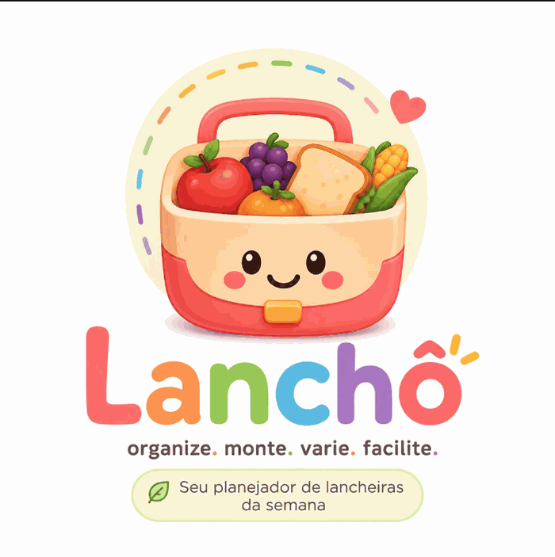

<p align="center">
  
</p>

# Lanchô

Aplicação web que monta o lanche escolar da semana (segunda a sexta) a partir dos
alimentos disponíveis em casa. Implementa o [PRD](prd.md).

Roda **100% no navegador**: sem backend, banco de dados, login ou API de IA.
Nenhuma informação sobre a criança ou os alimentos sai do dispositivo.

## Como rodar

```bash
npm install
npm run dev      # http://localhost:3000
```

| Script              | O que faz                                    |
| ------------------- | -------------------------------------------- |
| `npm run dev`       | ambiente de desenvolvimento                  |
| `npm run build`     | site estático em `out/` (deploy sem servidor) |
| `npm test`          | testes das regras de domínio                 |
| `npm run typecheck` | checagem de tipos                            |
| `npm run lint`      | ESLint                                       |

## Regra do lanche

Cada dia tem **exatamente 2 frutas diferentes + 1 salgado OU doce**. Sem exceção.

Além disso, cada dia recebe **1 bebida** — suco, iogurte, água de coco, leite —
quando o usuário informa alguma. A bebida é **opcional**: sem nenhuma na lista, a
semana é montada do mesmo jeito, só sem a linha da bebida (e o app avisa que dá
para incluir).

O planejamento é **determinístico**: a mesma lista de alimentos sempre gera a
mesma semana. As regras não dependem da interpretação de um modelo de IA.

- frutas: nunca iguais no mesmo dia, duplas não se repetem antes de esgotar as
  demais e o uso é equilibrado entre as frutas informadas;
- acompanhamentos: alternam salgado e doce quando possível e nunca repetem em
  dias consecutivos se houver alternativa;
- bebidas: todas as informadas são usadas antes de qualquer repetição e nunca
  se repetem em dias consecutivos se houver alternativa;
- quando pão e queijo (ou outras combinações conhecidas) estão disponíveis, eles
  contam como **um** acompanhamento: "Pão com queijo".

## Arquitetura

A lógica de negócio fica fora dos componentes React:

```
src/
├── app/                  # rota única, estática
├── components/           # Chat, FoodInput, UnknownFood, WeeklyPlan, SnackCard, Suggestions
├── domain/               # tipos e regras: food, snack, plannerState (máquina de estados), messages
├── services/             # foodParser, foodClassifier, snackPlanner, suggestionEngine, pdfGenerator
└── data/                 # foods (catálogo + combinações), suggestions
```

O estado vive só em memória (`useReducer` sobre `plannerReducer`). Recarregar a
página zera tudo — é o comportamento previsto no PRD §20.

## Como estender

**Novo alimento**: uma linha em [`src/data/foods.ts`](src/data/foods.ts).

```ts
{ name: "Melão", category: "fruit", emoji: "🍈", aliases: ["melao"] }
```

As categorias são `fruit`, `savory`, `sweet` e `drink`. Só `savory` e `sweet`
disputam o acompanhamento do dia; `drink` tem lugar próprio no card.

`aliases` cobre variações regionais e erros de digitação — a busca já ignora
acentos e maiúsculas. `refrigerationRecommended: true` faz o item entrar no aviso
de lancheira térmica.

**Nova combinação** (dois itens que valem como um acompanhamento): `FOOD_COMBOS`,
no mesmo arquivo. Frutas nunca são consumidas por combinações.

**Nova sugestão**: [`src/data/suggestions.ts`](src/data/suggestions.ts), com
`region` (`northeast` prioriza) e o motivo exibido ao usuário.

Idade e localização ainda não são configuráveis, mas nada no domínio depende
delas — a evolução prevista no PRD §5 não exige reescrever as regras.

## Marca

A logomarca vive em [`public/`](public/): `lancho-logo.png` é a arte completa e
`lancho-mark.png` é só a lancheira — ela é o ícone do PWA, o favicon, o símbolo
no topo da tela e o do cabeçalho do PDF. O letreiro "Lanchô" do cabeçalho é
**texto**, colorido letra a letra com os tokens `--lancho-*` de
[`globals.css`](src/app/globals.css), para ficar nítido em qualquer tamanho.

Os ícones em `public/icons/` e o favicon são derivados da arte por
[`scripts/generate-brand-assets.py`](scripts/generate-brand-assets.py) — trocou a
logo? Substitua `lancho-logo.png` e rode o script (precisa de Pillow).

## PWA

O app é instalável na tela inicial e funciona offline depois da primeira visita.

- [`src/app/manifest.ts`](src/app/manifest.ts) — manifest (nome, ícones, cores,
  `display: standalone`). É uma rota, por isso o `dynamic = "force-static"`
  exigido pelo `output: "export"`.
- [`public/sw.js`](public/sw.js) — service worker: navegação com _network-first_
  (cai no cache quando não há rede), `/_next/static/` com _cache-first_ (nomes
  versionados por hash) e ícones com _stale-while-revalidate_.
  **Ao alterar esse arquivo, suba a constante `VERSION`** — é ela que descarta os
  caches antigos na ativação.
- [`src/components/ServiceWorkerRegistrar.tsx`](src/components/ServiceWorkerRegistrar.tsx)
  — registra o worker, só em produção (em `next dev` ele serviria cache por cima
  do HMR).

Como o estado vive em memória (PRD §20), "offline" significa abrir e montar a
semana sem rede — não retomar um planejamento anterior.

Testar: `npm run build && npx serve out` e, no Chrome DevTools, aba Network >
Offline. Instalação exige **HTTPS** (localhost também vale).

## Deploy

`npm run build` gera `out/`, uma pasta estática que pode ser servida por
qualquer hospedagem (Vercel, Netlify, GitHub Pages, S3).

O `sw.js` deve ser servido sem cache de longa duração (`Cache-Control:
no-cache`), senão o navegador pode demorar a ver uma versão nova do worker.
